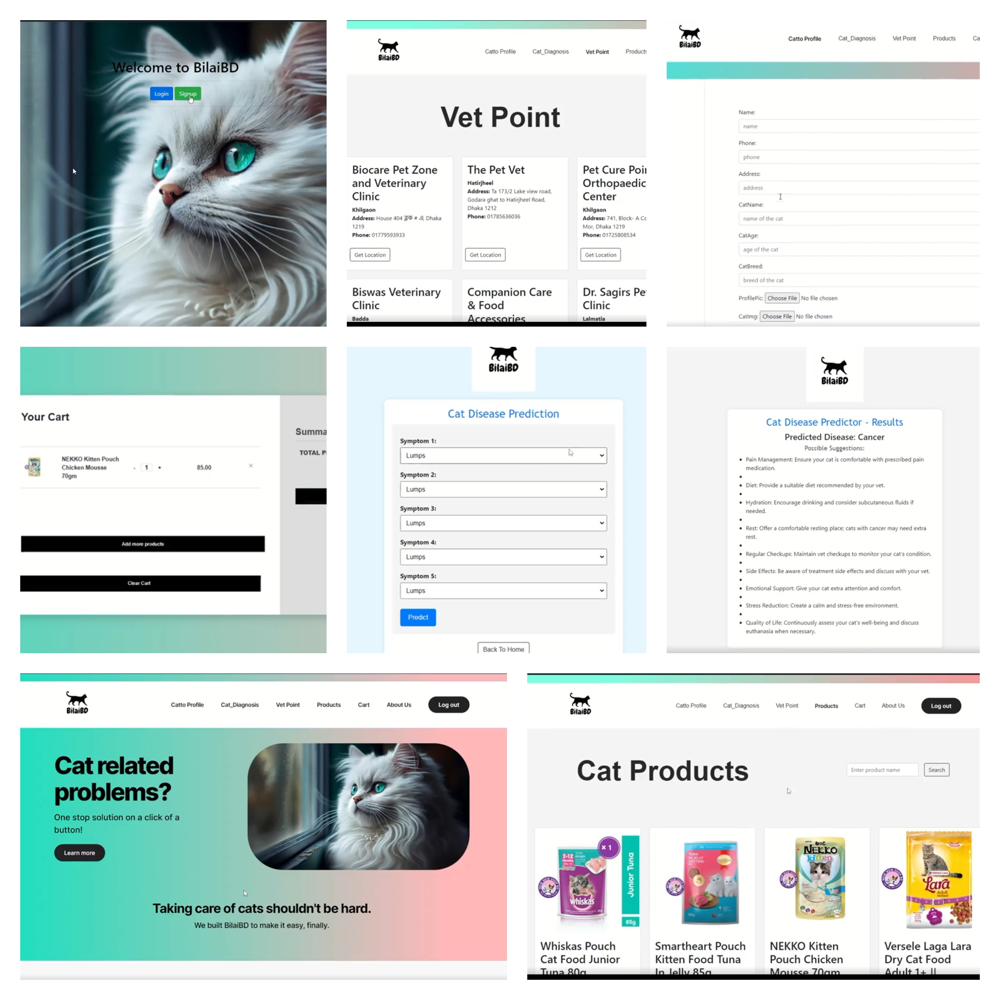

# BilaiBD - Cat Disease Prediction Web App



---

## 📖 Overview
**BilaiBD** is a web application that leverages **machine learning** to predict diseases in cats, providing **early diagnosis and precautionary advice** to pet owners.  

This project was a fantastic opportunity to apply both **web development** and **machine learning** skills in a practical, impactful way. 💻🔬  

---

## 🔧 Technology Stack
- **Front-end:** HTML, CSS  
- **Back-end:** Python, Django Framework  
- **Database:** MySQL  
- **Machine Learning Model:** Naive Bayes Classifier  
- **Libraries:** Pandas, NumPy, Scikit-learn  
- **Deployment:** Django  

---

## ✨ Main Features
- 🔺 Cat profile management  
- 🔺 Disease prediction system with suggestions for each disease  
- 🔺 Marketplace for cat products  
- 🔺 Shopping cart system  
- 🔺 Vet Point: Information on nearby veterinarians  

---

## 🎥 Demo & Screenshots
🔗 **Live Demo:** [Add your hosted link here]  

📸 **Screenshots:**  
(Add screenshots or GIFs here showing key pages and features)  

---

## 🛠️ How to Run Locally

1. **Clone the repository and set up environment**
```bash
git clone https://github.com/your-username/BilaiBD.git
cd BilaiBD

# Create & activate virtual environment
# Windows (PowerShell)
python -m venv venv
venv\Scripts\activate

# Mac/Linux
python3 -m venv venv
source venv/bin/activate

# Install dependencies
pip install -r requirements.txt
